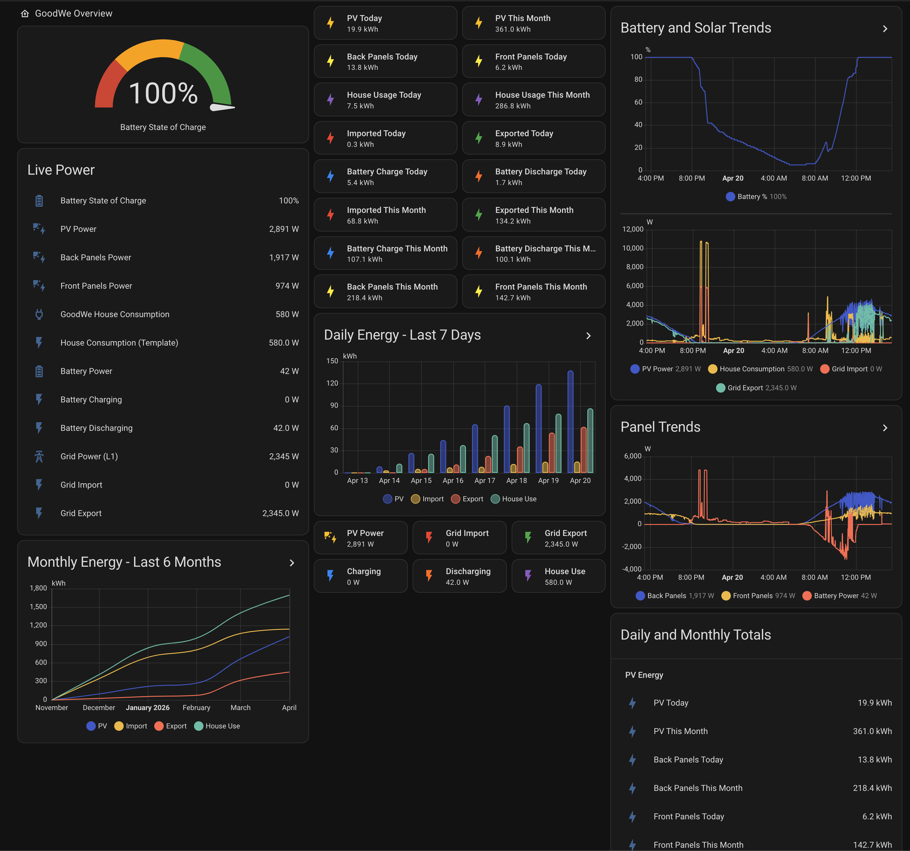

# GoodWE HA Dashboard

A Home Assistant dashboard for **GoodWe inverters** with battery, grid import/export, house consumption, and front/back panel visibility.

This dashboard is built around the native GoodWe Home Assistant integration plus a small set of helper sensors that:

- split bidirectional grid power into **import** and **export**
- split battery power into **charge** and **discharge**
- calculate **house consumption**
- convert power sensors in **W** into energy sensors in **kWh**
- create **daily** and **monthly** utility meters
- add separate **PV1** and **PV2** daily/monthly energy helpers for front and back panel views

The native GoodWe integration is the recommended starting point in Home Assistant, and GoodWe’s best-supported Energy Dashboard sensors are the total import/export, total PV generation, and total battery charge/discharge values on supported models. [web:223][web:269]

## Features

- Battery SoC gauge
- Live power view for PV, battery, house, and grid
- Daily and monthly summary tiles
- 24-hour trend graphs
- 7-day daily energy statistics
- 6-month monthly energy statistics
- Separate front/back panel sections using PV1 and PV2 helper sensors

## Screenshot


## Requirements

- Home Assistant with the native **GoodWe** integration working correctly.
- A GoodWe inverter exposing the common live sensors such as:
  - `sensor.goodwe_pv_power`
  - `sensor.goodwe_pv1_power`
  - `sensor.goodwe_pv2_power`
  - `sensor.goodwe_battery_power`
  - `sensor.goodwe_battery_state_of_charge`
  - `sensor.goodwe_active_power` or `sensor.goodwe_active_power_l1`
- YAML dashboard mode or a manual Lovelace dashboard

## Entities used

### Native GoodWe sensors
- `sensor.goodwe_battery_state_of_charge`
- `sensor.goodwe_pv_power`
- `sensor.goodwe_pv1_power`
- `sensor.goodwe_pv2_power`
- `sensor.goodwe_house_consumption`
- `sensor.goodwe_battery_power`
- `sensor.goodwe_active_power`
- `sensor.goodwe_active_power_l1`

### Helper sensors created by this project
- `sensor.energy_buy`
- `sensor.energy_sell`
- `sensor.energy_battery_charge`
- `sensor.energy_battery_discharge`
- `sensor.house_consumption`

### Energy sum sensors
- `sensor.energy_buy_sum`
- `sensor.energy_sell_sum`
- `sensor.energy_battery_charge_sum`
- `sensor.energy_battery_discharge_sum`
- `sensor.pv_power_sum`
- `sensor.house_consumption_sum`
- `sensor.pv1_energy_sum`
- `sensor.pv2_energy_sum`

### Daily and monthly utility meters
- `sensor.energy_buy_daily`
- `sensor.energy_buy_monthly`
- `sensor.energy_sell_daily`
- `sensor.energy_sell_monthly`
- `sensor.house_consumption_daily`
- `sensor.house_consumption_monthly`
- `sensor.energy_battery_charge_daily`
- `sensor.energy_battery_charge_monthly`
- `sensor.energy_battery_discharge_daily`
- `sensor.energy_battery_discharge_monthly`
- `sensor.pv_energy_daily`
- `sensor.pv_energy_monthly`
- `sensor.pv1_energy_daily`
- `sensor.pv1_energy_monthly`
- `sensor.pv2_energy_daily`
- `sensor.pv2_energy_monthly`

## Installation

### 1. Install the GoodWe integration

Set up the native GoodWe integration in Home Assistant and confirm the inverter sensors are updating correctly. Home Assistant recommends the native integration for most users.

### 2. Add the helper sensors

Add the following to your `configuration.yaml`.

> Note:
> - `sensor.goodwe_active_power` is used to split grid import/export.
> - `sensor.goodwe_battery_power` is used to split battery charge/discharge.
> - `sensor.goodwe_pv1_power` and `sensor.goodwe_pv2_power` are used to create panel-specific daily/monthly energy helpers.
> - `unit_time: h` is included so the integration platform correctly converts W into kWh. 

```yaml
template:
  - sensor:
      - name: "Energy Buy"
        unique_id: energy_buy
        device_class: power
        state_class: measurement
        unit_of_measurement: "W"
        state: >
          
            {{ states('sensor.goodwe_active_power')|float(0) * -1 }}
          
            0
          
        availability: "{{ states('sensor.goodwe_active_power') not in ['unknown', 'unavailable'] }}"

      - name: "Energy Sell"
        unique_id: energy_sell
        device_class: power
        state_class: measurement
        unit_of_measurement: "W"
        state: >
          
            {{ states('sensor.goodwe_active_power')|float(0) }}
          
            0
          
        availability: "{{ states('sensor.goodwe_active_power') not in ['unknown', 'unavailable'] }}"

      - name: "Energy Battery Charge"
        unique_id: energy_battery_charge
        device_class: power
        state_class: measurement
        unit_of_measurement: "W"
        state: >
          
            {{ states('sensor.goodwe_battery_power')|float(0) * -1 }}
          
            0
          
        availability: "{{ states('sensor.goodwe_battery_power') not in ['unknown', 'unavailable'] }}"

      - name: "Energy Battery Discharge"
        unique_id: energy_battery_discharge
        device_class: power
        state_class: measurement
        unit_of_measurement: "W"
        state: >
          
            {{ states('sensor.goodwe_battery_power')|float(0) }}
          
            0
          
        availability: "{{ states('sensor.goodwe_battery_power') not in ['unknown', 'unavailable'] }}"

      - name: "House Consumption"
        unique_id: house_consumption
        device_class: power
        state_class: measurement
        unit_of_measurement: "W"
        state: >
          {{
            (states('sensor.goodwe_pv_power')|float(0))
            + (states('sensor.energy_buy')|float(0))
            + (states('sensor.energy_battery_discharge')|float(0))
            - (states('sensor.energy_sell')|float(0))
            - (states('sensor.energy_battery_charge')|float(0))
          }}
        availability: >
          {{ states('sensor.goodwe_pv_power') not in ['unknown', 'unavailable']
             and states('sensor.energy_buy') not in ['unknown', 'unavailable']
             and states('sensor.energy_battery_discharge') not in ['unknown', 'unavailable']
             and states('sensor.energy_sell') not in ['unknown', 'unavailable']
             and states('sensor.energy_battery_charge') not in ['unknown', 'unavailable'] }}

sensor:
  - platform: integration
    source: sensor.energy_buy
    name: energy_buy_sum
    unit_prefix: k
    unit_time: h
    round: 2
    method: left

  - platform: integration
    source: sensor.energy_sell
    name: energy_sell_sum
    unit_prefix: k
    unit_time: h
    round: 2
    method: left

  - platform: integration
    source: sensor.energy_battery_charge
    name: energy_battery_charge_sum
    unit_prefix: k
    unit_time: h
    round: 2
    method: left

  - platform: integration
    source: sensor.energy_battery_discharge
    name: energy_battery_discharge_sum
    unit_prefix: k
    unit_time: h
    round: 2
    method: left

  - platform: integration
    source: sensor.goodwe_pv_power
    name: pv_power_sum
    unit_prefix: k
    unit_time: h
    round: 2
    method: left

  - platform: integration
    source: sensor.house_consumption
    name: house_consumption_sum
    unit_prefix: k
    unit_time: h
    round: 2
    method: left

  - platform: integration
    source: sensor.goodwe_pv1_power
    name: pv1_energy_sum
    unit_prefix: k
    unit_time: h
    round: 2
    method: left

  - platform: integration
    source: sensor.goodwe_pv2_power
    name: pv2_energy_sum
    unit_prefix: k
    unit_time: h
    round: 2
    method: left

utility_meter:
  energy_buy_daily:
    source: sensor.energy_buy_sum
    cycle: daily
  energy_buy_monthly:
    source: sensor.energy_buy_sum
    cycle: monthly

  energy_sell_daily:
    source: sensor.energy_sell_sum
    cycle: daily
  energy_sell_monthly:
    source: sensor.energy_sell_sum
    cycle: monthly

  house_consumption_daily:
    source: sensor.house_consumption_sum
    cycle: daily
  house_consumption_monthly:
    source: sensor.house_consumption_sum
    cycle: monthly

  energy_battery_charge_daily:
    source: sensor.energy_battery_charge_sum
    cycle: daily
  energy_battery_charge_monthly:
    source: sensor.energy_battery_charge_sum
    cycle: monthly

  energy_battery_discharge_daily:
    source: sensor.energy_battery_discharge_sum
    cycle: daily
  energy_battery_discharge_monthly:
    source: sensor.energy_battery_discharge_sum
    cycle: monthly

  pv_energy_daily:
    source: sensor.pv_power_sum
    cycle: daily
  pv_energy_monthly:
    source: sensor.pv_power_sum
    cycle: monthly

  pv1_energy_daily:
    source: sensor.pv1_energy_sum
    cycle: daily
  pv1_energy_monthly:
    source: sensor.pv1_energy_sum
    cycle: monthly

  pv2_energy_daily:
    source: sensor.pv2_energy_sum
    cycle: daily
  pv2_energy_monthly:
    source: sensor.pv2_energy_sum
    cycle: monthly
```

### 3. Restart Home Assistant

After adding the YAML, do a full Home Assistant restart so the new template, integration, and utility meter entities are created. YAML utility meter entities often need a full restart before they appear correctly. 

### 4. Add the dashboard

Copy the dashboard YAML from this repository into a manual Lovelace dashboard or a YAML-mode dashboard.

## Dashboard notes

- The dashboard uses the **original layout** with corrected sensor sources.
- Grid import/export and battery charge/discharge are based on split helper sensors because GoodWe exposes these as signed power values rather than separate positive-only entities. 
- `pv1_energy_daily`, `pv1_energy_monthly`, `pv2_energy_daily`, and `pv2_energy_monthly` are custom helpers added so the front/back panel labels remain accurate in the dashboard. 

## Statistics graph fix

For the daily and monthly statistics cards, use `stat_types: state` rather than `sum`. Daily utility meter sensors can otherwise appear as cumulative totals across days and show inflated axes. This behavior has been reported by Home Assistant users working with utility meter and statistics graphs.

Example:

```yaml
- type: statistics-graph
  title: Daily Energy - Last 7 Days
  chart_type: bar
  days_to_show: 7
  period: day
  stat_types:
    - state
```

## Troubleshooting

### PV totals are missing
Check for typos in the integration source entity. For example, `sensor.goodwee_pv_power` is incorrect; it must be `sensor.goodwe_pv_power`. If the source entity is wrong, `pv_power_sum`, `pv_energy_daily`, and `pv_energy_monthly` will not work. 

### Cards show "Entity not found"
This usually means:
- the helper entities were not created yet
- Home Assistant has not been restarted after editing YAML
- the dashboard is referencing an entity name that no longer exists after reinstall

### Cards show `Unknown`
This usually means the entity exists but has not produced valid data yet, or a source sensor upstream is unavailable.

### Panel day/month labels are wrong
If `pv1_energy_daily`, `pv1_energy_monthly`, `pv2_energy_daily`, and `pv2_energy_monthly` are missing, the dashboard can only show live PV1/PV2 power, not daily/monthly kWh. The extra PV1/PV2 helpers in this project solve that.

## Credits

- Native GoodWe integration for Home Assistant.
- Community approaches for GoodWe Energy Dashboard helper sensors and split import/export or charge/discharge entities.
